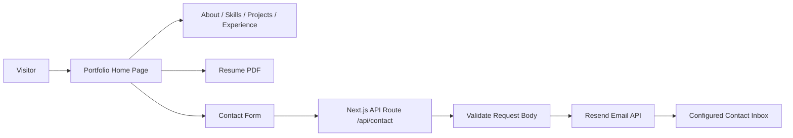

# Ashika Kambang Portfolio

A modern personal portfolio for **Ashika Kambang**, built to present full-stack projects, backend engineering skills, professional experience, resume access, and a working contact flow in one polished web experience.

This project is more than a static profile page. It uses a full-stack Next.js setup with reusable sections, theme persistence, animated UI, optimized images, resume download support, and a Resend-powered contact API route.

## Why This Project Is Recruiter-Friendly

- It gives a clear first impression of Ashika's focus: backend engineering, full-stack development, and AI-powered applications.
- It highlights real project work across career intelligence, vehicle management, healthcare, learning platforms, cinema operations, and data analysis.
- It includes a functional contact form with server-side validation and email delivery through Resend.
- It demonstrates modern frontend implementation with Next.js, React, TypeScript, Tailwind CSS, motion-based animations, and responsive layouts.
- It keeps the portfolio easy to scan with dedicated sections for About, Skills, Projects, Experience, Resume, and Contact.

## Core Features

### Portfolio Experience

- Hero section with profile image, resume download, project CTA, and contact CTA.
- About section with professional summary, focus areas, stats, current goals, and personal interests.
- Skills grid covering backend, frontend, databases, AI/data, cloud, and development tools.
- Featured project cards with project descriptions, tags, and GitHub links.
- Professional journey timeline for education, internship experience, and certifications.
- Responsive navigation with smooth anchor links and mobile menu support.

### Theme & UI

- Light and dark theme support.
- Theme preference stored in `localStorage`.
- Animated sections using Motion.
- Glass-style cards, gradient text, responsive grids, and optimized typography.
- Google fonts loaded through `next/font`.

### Contact System

- Contact form with name, email, subject, and message fields.
- Client-side sending state and success/error messages.
- Server-side field cleanup and validation.
- Email delivery through the Resend API.
- Environment-based contact destination.

## Tech Stack

### Frontend

- Next.js 16
- React 19
- TypeScript
- Tailwind CSS 4
- Motion / Framer Motion
- Lucide React
- React Icons
- Next Image Optimization
- Next Font Optimization

### Backend / API

- Next.js App Router API Routes
- Resend email API
- Server-side request validation
- Environment variable configuration

### Tooling

- ESLint 9
- npm
- TypeScript configuration
- PostCSS / Tailwind configuration

## Project Sections

| Section | Purpose |
|---|---|
| Hero | Introduces Ashika, key focus areas, resume download, and main calls to action. |
| About | Explains background, development journey, focus areas, and personality. |
| Skills | Shows technologies across backend, frontend, databases, AI/data, and tools. |
| Projects | Highlights selected full-stack, enterprise, AI, and analytics projects. |
| Experience | Presents education, internship experience, and certifications. |
| Contact | Lets visitors send a message directly from the portfolio. |

## Featured Projects

- **Lakshya**: AI career intelligence platform with resume analysis, job matching, recommendations, recruiter workflows, and notifications.
- **Vehicle Management System**: Full-stack parts inventory and service management platform using React, ASP.NET Core, PostgreSQL, JWT, and EF Core.
- **Cliniterra**: Healthcare appointment management system using Jakarta EE, JSP, Servlets, JDBC, MySQL, and MVC architecture.
- **BrainBuzz**: Quiz and learning platform with JWT authentication, role-based authorization, automated scoring, and REST APIs.
- **Kumari Cinemas**: Cinema operations and ticket management system built with ASP.NET Web Forms, C#, Oracle, and Bootstrap.
- **Crime Data Analysis**: Python analytics project for exploring trends, patterns, and dataset insights.

## Folder Structure

```text
my-portfolio/
|-- app/
|   |-- api/contact/route.ts      # Contact form API route using Resend
|   |-- contact/page.tsx          # Standalone contact page
|   |-- globals.css               # Tailwind, theme tokens, global utilities
|   |-- layout.tsx                # App shell, fonts, metadata, navbar
|   `-- page.tsx                  # Home route rendering the portfolio app
|-- public/
|   |-- cv/                       # Resume PDF
|   |-- profile.jpg               # Main profile image
|   `-- infobrain-logo.png        # Experience logo asset
|-- src/
|   |-- App.tsx                   # Main page composition
|   |-- components/               # Portfolio sections and shared UI
|   `-- lib/                      # Utility helpers
|-- next.config.ts
|-- package.json
|-- tailwind.config.ts
`-- tsconfig.json
```

## Application Flow



## Local Setup

### Prerequisites

- Node.js 20+
- npm
- A Resend API key if you want the contact form to send emails

### Installation

```bash
npm install
```

### Environment Variables

Create a `.env.local` file in the project root:

```env
RESEND_API_KEY=your_resend_api_key_here
CONTACT_EMAIL=your_email@example.com
```

`RESEND_API_KEY` is used by the contact API route.
`CONTACT_EMAIL` is the inbox where portfolio messages will be delivered.

### Run Development Server

```bash
npm run dev
```

Open `http://localhost:3000` in your browser.

### Build for Production

```bash
npm run build
```

### Start Production Server

```bash
npm run start
```

### Lint

```bash
npm run lint
```

## Environment Notes

- The contact form posts to `/api/contact`.
- Missing `RESEND_API_KEY` or `CONTACT_EMAIL` will return a safe error response instead of exposing internal details.
- The email sender currently uses Resend's default onboarding sender: `Portfolio Contact <onboarding@resend.dev>`.
- Resume downloads are served from `public/cv/Ashika-Kambang-Resume.pdf`.

## Engineering Decisions

- The main UI is broken into focused section components to keep the page easy to maintain.
- Next.js App Router is used for routing and the contact API endpoint.
- `next/image` is used for profile and logo assets.
- `next/font` loads Space Grotesk and Inter with optimized font handling.
- Theme state is applied early in the layout to reduce dark/light mode flicker.
- Tailwind CSS custom tokens keep the warm light theme and dark theme consistent.
- The contact API validates input on the server before attempting email delivery.

## Improvements You Could Add Next

- Add a live project demo link for each featured project.
- Add Open Graph images for better LinkedIn and social sharing previews.
- Add form rate limiting or CAPTCHA protection for the contact endpoint.
- Add unit tests for the contact API validation.
- Add a dedicated case-study page for Lakshya and other major projects.
- Add analytics to understand which sections visitors engage with most.

## Summary

This portfolio presents Ashika Kambang as a backend-focused full-stack developer with interest in AI-powered applications. It combines a polished visual experience with practical engineering details: responsive design, typed React components, App Router routing, optimized assets, persistent theme support, and a working email contact flow.
